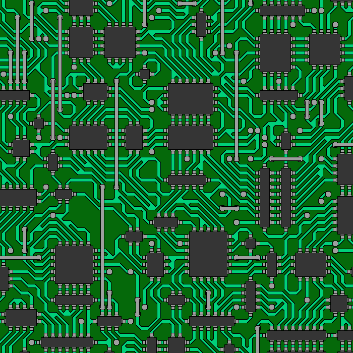

# Wave Function Collapse

Python-implemented of a tilemap generator inspired by wave function collapse
using the example https://github.com/mxgmn/WaveFunctionCollapse

The Castle, Knots and Circuit tiles are from the repository linked above


## Requirements
 * Python 3.7+
 * Pillow

```sh
$ pip3 install -r requirements.txt
```

## Usage
You can look at the examples in the [wfc/_\_main__.py](https://github.com/baskiton/wfc/blob/main/wfc/__main__.py) file and follow them.

You can also run these GUI examples:
```sh
$ python3 -m wfc
```

## Examples




